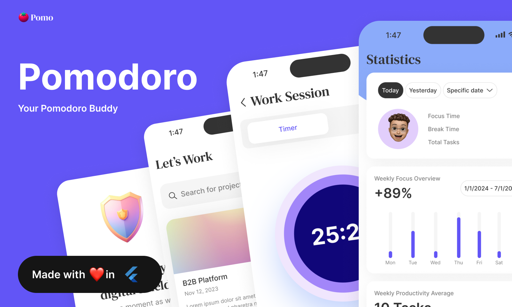
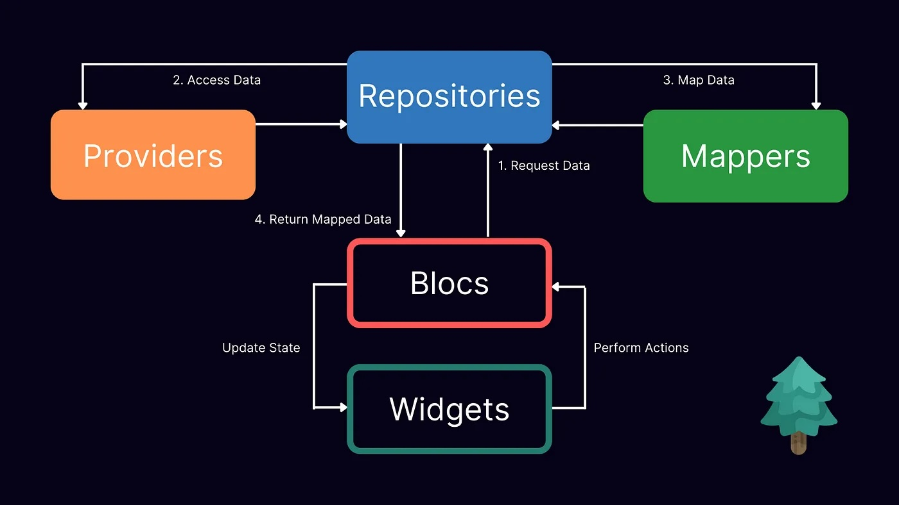
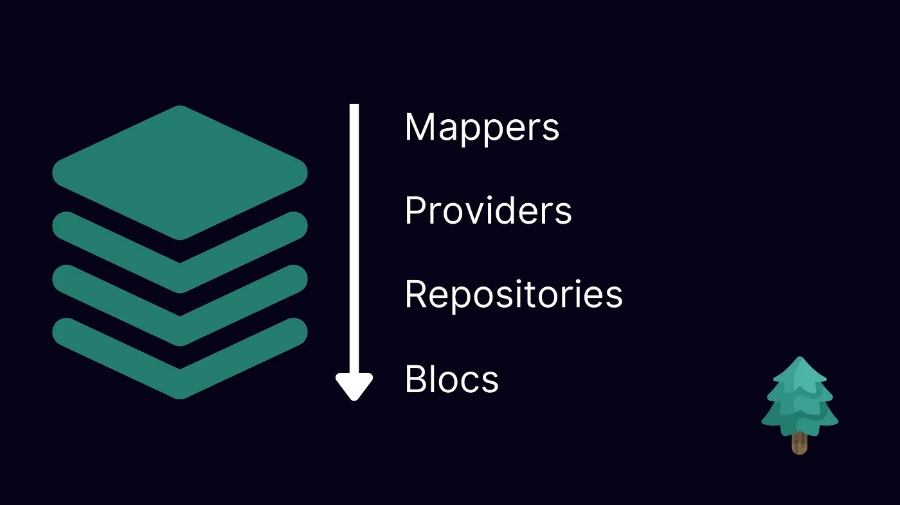

<!-- Improved compatibility of back to top link: See: https://github.com/othneildrew/Best-README-Template/pull/73 -->
<a name="readme-top"></a>
<!--
*** Thanks for checking out the Best-README-Template. If you have a suggestion
*** that would make this better, please fork the repo and create a pull request
*** or simply open an issue with the tag "enhancement".
*** Don't forget to give the project a star!
*** Thanks again! Now go create something AMAZING! :D
-->




## About the project

Pomo is an app for managing tasks and projects. Users can log in or register and create new project.
 
 - Each project contains a certain number of tasks, users can add/edit/delete tasks. Each project also has contributors, the owner of the project can easly invite new friends to collaborate to the project. 

 - Each task contains several number of pomodoros, when the user start the task he's redirected to the Work Session, where he can start a timer, that uses pomodoro technique.

 - The user can also go and start a Quick Session that is completly indipendent to a project. 

 - In the Statistics page the user can access to all the progress about tasks and project.

 - There is also a Profile page where user can interact with his account.

### Built With

<div align="left">
  
  
  
  
  
   
  
</div>

<p align="right">(<a href="#readme-top">back to top</a>)</p>

## Architecture  <a name="architecture"></a>

This project uses the [Pine Architecture](https://github.com/MyLittleSuite/pine):

<table>
  <tr>
    <td valign="top"></td>
    <td valign="top"></td>
  </tr>
</table>


<!-- GETTING STARTED -->
## Getting Started

Follow these steps to setup the project locally on your machine. Please notice that these steps are for macOS system only, for Linux and Windows machines please take a look at the [official documentation](https://docs.flutter.dev/get-started/install) of Flutter.

### Prerequisites

For a correct installation of the project you need to install first Flutter, [here](https://docs.flutter.dev/get-started/install/macos/desktop?tab=download) you can find all the resources for that. Once you install flutter on your macOS system run these command to see if everything is working correcly.

```sh
  flutter doctor -v
   ```

### Installation

1. Clone the repo
   ```sh
   git clone https://github.com/fres-sudo/pomo.git
   ```
2. Open the project and get the packages
   ```sh
   flutter pub get
   ```
3. Run the builder 
   ```sh
    dart run build_runner watch --delete-conflicting-outputs
   ```

<p align="right">(<a href="#readme-top">back to top</a>)</p>


<!-- CONTRIBUTING -->
## Contributing

Contributions are what make the open source community such an amazing place to learn, inspire, and create. Any contributions you make are **greatly appreciated**.

If you have a suggestion that would make this better, please fork the repo and create a pull request. You can also simply open an issue with the tag "enhancement".
Don't forget to give the project a star! Thanks again!

1. Fork the Project
2. Create your Feature Branch (`git checkout -b feature/AmazingFeature`)
3. Commit your Changes (`git commit -m 'Add some AmazingFeature'`)
4. Push to the Branch (`git push origin feature/AmazingFeature`)
5. Open a Pull Request

<p align="right">(<a href="#readme-top">back to top</a>)</p>


<!-- LICENSE -->
## License

Distributed under the MIT License. See `LICENSE.txt` for more information.

<p align="right">(<a href="#readme-top">back to top</a>)</p>


<!-- CONTACT -->
## Contact

 - 📬 Email: francescocalicchio@hotmail.com
 - 👤 Linkedin: [francesco-calicchio](https://www.linkedin.com/in/francesco-calicchio/)
 
Project Link: [https://github.com/fres-sudo/pomo](https://github.com/fres-sudo/pomo)

<p align="right">(<a href="#readme-top">back to top</a>)</p>


<!-- MARKDOWN LINKS & IMAGES -->
<!-- https://www.markdownguide.org/basic-syntax/#reference-style-links -->
[contributors-shield]: https://img.shields.io/github/contributors/fres-sudo/pomo.svg?style=for-the-badge
[contributors-url]: https://github.com/fres-sudo/pomo/graphs/contributors
[forks-shield]: https://img.shields.io/github/forks/fres-sudo/pomo.svg?style=for-the-badge
[forks-url]: https://github.com/fres-sudo/pomo/network/members
[stars-shield]: https://img.shields.io/github/stars/fres-sudo/pomo.svg?style=for-the-badge
[stars-url]: https://github.com/fres-sudo/pomo/stargazers
[issues-shield]: https://img.shields.io/github/issues/fres-sudo/pomo.svg?style=for-the-badge
[issues-url]: https://github.com/fres-sudo/pomo/issues
[license-shield]: https://img.shields.io/github/license/fres-sudo/pomo.svg?style=for-the-badge
[license-url]: https://github.com/fres-sudo/pomo/blob/master/LICENSE.txt
[linkedin-shield]: https://img.shields.io/badge/-LinkedIn-black.svg?style=for-the-badge&logo=linkedin&colorB=555
[linkedin-url]: https://linkedin.com/in/francesco-calicchio
[product-screenshot]: images/screenshot.png
[Next.js]: https://img.shields.io/badge/next.js-000000?style=for-the-badge&logo=nextdotjs&logoColor=white
[Next-url]: https://nextjs.org/
[React.js]: https://img.shields.io/badge/React-20232A?style=for-the-badge&logo=react&logoColor=61DAFB
[React-url]: https://reactjs.org/
[Vue.js]: https://img.shields.io/badge/Vue.js-35495E?style=for-the-badge&logo=vuedotjs&logoColor=4FC08D
[Vue-url]: https://vuejs.org/
[Angular.io]: https://img.shields.io/badge/Angular-DD0031?style=for-the-badge&logo=angular&logoColor=white
[Angular-url]: https://angular.io/
[Svelte.dev]: https://img.shields.io/badge/Svelte-4A4A55?style=for-the-badge&logo=svelte&logoColor=FF3E00
[Svelte-url]: https://svelte.dev/
[Laravel.com]: https://img.shields.io/badge/Laravel-FF2D20?style=for-the-badge&logo=laravel&logoColor=white
[Laravel-url]: https://laravel.com
[Bootstrap.com]: https://img.shields.io/badge/Bootstrap-563D7C?style=for-the-badge&logo=bootstrap&logoColor=white
[Bootstrap-url]: https://getbootstrap.com
[JQuery.com]: https://img.shields.io/badge/jQuery-0769AD?style=for-the-badge&logo=jquery&logoColor=white
[JQuery-url]: https://jquery.com 
