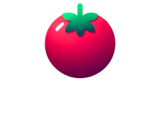
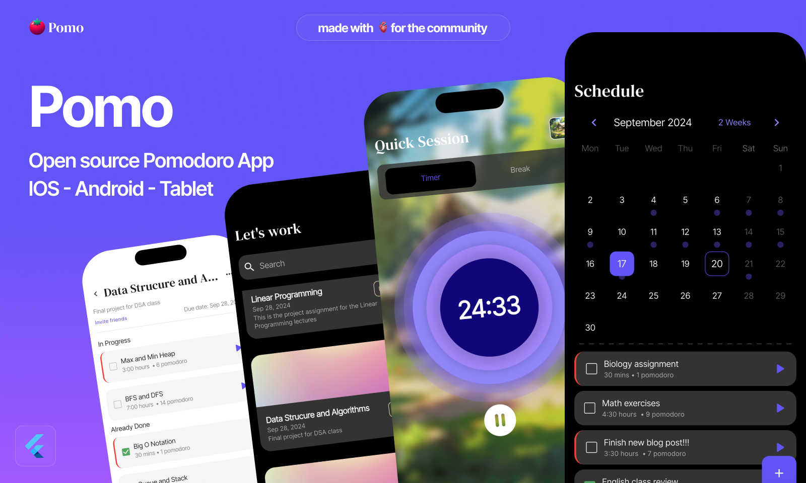

<!-- Improved compatibility of back to top link: See: https://github.com/othneildrew/Best-README-Template/pull/73 -->
<a name="readme-top"></a>
<!--
*** Thanks for checking out the Best-README-Template. If you have a suggestion
*** that would make this better, please fork the repo and create a pull request
*** or simply open an issue with the tag "enhancement".
*** Don't forget to give the project a star!
*** Thanks again! Now go create something AMAZING! :D
-->


<!-- PROJECT SHIELDS -->
<!--
*** I'm using markdown "reference style" links for readability.
*** Reference links are enclosed in brackets [ ] instead of parentheses ( ).
*** See the bottom of this document for the declaration of the reference variables
*** for contributors-url, forks-url, etc. This is an optional, concise syntax you may use.
*** https://www.markdownguide.org/basic-syntax/#reference-style-links
-->
[![Contributors][contributors-shield]][contributors-url]
[![Forks][forks-shield]][forks-url]
[![Stargazers][stars-shield]][stars-url]
[![Issues][issues-shield]][issues-url]
[![MIT License][license-shield]][license-url]
[![LinkedIn][linkedin-shield]][linkedin-url]


<!-- PROJECT LOGO -->
<br />
<div align="center">
  <a href="https://github.com/fres-sudo/pomo">
    
  </a>


  <p align="center">
    <br />
    Your Pomodoro Buddy 🫂
    <br />
    <br />
    <a href="https://github.com/fres-sudo/pomo">View Demo</a>
    ·
    <a href="https://github.com/fres-sudo/pomo/issues">Report Bug</a>
    ·
    <a href="https://github.com/fres-sudo/pomo/issues">Request Feature</a>
  </p>
</div>


<!-- TABLE OF CONTENTS -->
<details>
  <summary>Table of Contents</summary>
  <ol>
    <li>
      <a href="#about-the-project">About The Project</a>
      <ul>
        <li><a href="#built-with">Built With</a></li>
      </ul>
    </li>
    <li>
      <a href="#getting-started">Getting Started</a>
      <ul>
        <li><a href="#prerequisites">Prerequisites</a></li>
        <li><a href="#installation">Installation</a></li>
      </ul>
    </li>
    <li><a href="#usage">Usage</a></li>
    <li><a href="#roadmap">Roadmap</a></li>
    <li><a href="#contributing">Contributing</a></li>
    <li><a href="#license">License</a></li>
    <li><a href="#contact">Contact</a></li>
    <li><a href="#acknowledgments">Acknowledgments</a></li>
  </ol>
</details>


<!-- ABOUT THE PROJECT -->
## About The Project



Pomo is an app for managing tasks and projects. Users can log in or register and create new project.
 
 - Each project contains a certain number of tasks, users can add/edit/delete tasks. Each project also has contributors, the owner of the project can easly invite new friends to collaborate to the project. 

 - Each task contains several number of pomodoros, when the user start the task he's redirected to the Work Session, where he can start a timer, that uses pomodoro technique.

 - The user can also go and start a Quick Session that is completly indipendent to a project. 

 - In the Statistics page the user can access to all the progress about tasks and project.

 - There is also a Profile page where user can interact with his account.

<p align="right">(<a href="#readme-top">back to top</a>)</p>


### Built With

 <a href="https://flutter.dev" target="_blank" rel="noreferrer">  </a>
 <a href="https://dart.dev" target="_blank" rel="noreferrer">  </a>
  <a href="https://expressjs.com" target="_blank" rel="noreferrer">  </a>
  <a href="https://mongodb.com" target="_blank" rel="noreferrer">  </a>
  <a href="https://nodejs.org" target="_blank" rel="noreferrer">  </a>

<p align="right">(<a href="#readme-top">back to top</a>)</p>


<!-- GETTING STARTED -->
## Getting Started

Follow these steps to setup the project locally on your machine. Please notice that these steps are for macOS system only, for Linux and Windows machines please take a look at the [official documentation](https://docs.flutter.dev/get-started/install) of Flutter.

### Prerequisites

For a correct installation of the project you need to install first Flutter, [here](https://docs.flutter.dev/get-started/install/macos/desktop?tab=download) you can find all the resources for that. Once you install flutter on your macOS system run these command to see if everything is working correcly.

```sh
  flutter doctor -v
   ```

### Installation

1. Clone the repo
   ```sh
   git clone https://github.com/fres-sudo/pomo.git
   ```
2. Open the project and get the packages
   ```sh
   flutter pub get
   ```
3. Run the builder 
   ```sh
    dart run build_runner watch --delete-conflicting-outputs
   ```

<p align="right">(<a href="#readme-top">back to top</a>)</p>


## Architecture 

This project uses the [Pine Architecture](https://github.com/MyLittleSuite/pine):

<table>
  <tr>
    <td valign="top"></td>
    <td valign="top"></td>
  </tr>
</table>

<!-- USAGE EXAMPLES -->
## Usage

Use this space to show useful examples of how a project can be used. Additional screenshots, code examples and demos work well in this space. You may also link to more resources.

_For more examples, please refer to the [Documentation](https://example.com)_

<p align="right">(<a href="#readme-top">back to top</a>)</p>

<!-- ROADMAP -->😣
## Roadmap

- [ ] Projects 📋
  -  [Create](lib/pages/projects/create_project_page.dart)
  -  [Update](lib/pages/projects/create_project_page.dart)
  -  [Delete](lib/pages/projects/widgets/project_bottom_sheet.dart)
  - [ ] Tasks 🎯
    -  [Create](lib/pages/projects/widgets/task_bottom_sheet.dart) 
    -  [Update](lib/components/cards/task_card.dart)
    -  [Delete](lib/components/cards/task_card.dart)
    - [ ] Pomodoro 🍅
      - Start ▶️
      - Stop ⏸️
      - Resume ⏯️
      - Timer Options ⏳](lib/profile/widgets/set_timer_bottom_sheet.dart)
- [ ] [Quick Session ⏰](lib/pages/quick_session/quick_session_page.dart)
- [ ] [Statistics 📈](lib/pages/stats/stats_page.dart)
     - Detailed Focus / Break time
     - Weekly Improvment
     - Pomodoros per day
     - Line and Bar Charts
- [ ] [Authentication 🔐](lib/pages/authentication/)
  - [Login](lib/pages/authentication/login_in/login_page.dart)
  - [Register](lib/pages/authentication/sign_up/signup_page.dart)
  - [Forgot Password](lib/pages/authentication/forgot_password/forgotpassword_page.dart)
- [ ] Theming ☯️

See the [open issues](https://github.com/fres-sudo/pomo/issues) for a full list of proposed features (and known issues).

<p align="right">(<a href="#readme-top">back to top</a>)</p>


<!-- CONTRIBUTING -->
## Contributing

Contributions are what make the open source community such an amazing place to learn, inspire, and create. Any contributions you make are **greatly appreciated**.

If you have a suggestion that would make this better, please fork the repo and create a pull request. You can also simply open an issue with the tag "enhancement".
Don't forget to give the project a star! Thanks again!

1. Fork the Project
2. Create your Feature Branch (`git checkout -b feature/AmazingFeature`)
3. Commit your Changes (`git commit -m 'Add some AmazingFeature'`)
4. Push to the Branch (`git push origin feature/AmazingFeature`)
5. Open a Pull Request

<p align="right">(<a href="#readme-top">back to top</a>)</p>


<!-- LICENSE -->
## License

Distributed under the MIT License. See `LICENSE.txt` for more information.

<p align="right">(<a href="#readme-top">back to top</a>)</p>


<!-- CONTACT -->
## Contact

 - 📬 Email: francescocalicchio@hotmail.com
 - 👤 Linkedin: [francesco-calicchio](https://www.linkedin.com/in/francesco-calicchio/)
 
Project Link: [https://github.com/fres-sudo/pomo](https://github.com/fres-sudo/pomo)

<p align="right">(<a href="#readme-top">back to top</a>)</p>


<!-- MARKDOWN LINKS & IMAGES -->
<!-- https://www.markdownguide.org/basic-syntax/#reference-style-links -->
[contributors-shield]: https://img.shields.io/github/contributors/fres-sudo/pomo.svg?style=for-the-badge
[contributors-url]: https://github.com/fres-sudo/pomo/graphs/contributors
[forks-shield]: https://img.shields.io/github/forks/fres-sudo/pomo.svg?style=for-the-badge
[forks-url]: https://github.com/fres-sudo/pomo/network/members
[stars-shield]: https://img.shields.io/github/stars/fres-sudo/pomo.svg?style=for-the-badge
[stars-url]: https://github.com/fres-sudo/pomo/stargazers
[issues-shield]: https://img.shields.io/github/issues/fres-sudo/pomo.svg?style=for-the-badge
[issues-url]: https://github.com/fres-sudo/pomo/issues
[license-shield]: https://img.shields.io/github/license/fres-sudo/pomo.svg?style=for-the-badge
[license-url]: https://github.com/fres-sudo/pomo/blob/master/LICENSE.txt
[linkedin-shield]: https://img.shields.io/badge/-LinkedIn-black.svg?style=for-the-badge&logo=linkedin&colorB=555
[linkedin-url]: https://linkedin.com/in/francesco-calicchio
[product-screenshot]: images/screenshot.png
[Next.js]: https://img.shields.io/badge/next.js-000000?style=for-the-badge&logo=nextdotjs&logoColor=white
[Next-url]: https://nextjs.org/
[React.js]: https://img.shields.io/badge/React-20232A?style=for-the-badge&logo=react&logoColor=61DAFB
[React-url]: https://reactjs.org/
[Vue.js]: https://img.shields.io/badge/Vue.js-35495E?style=for-the-badge&logo=vuedotjs&logoColor=4FC08D
[Vue-url]: https://vuejs.org/
[Angular.io]: https://img.shields.io/badge/Angular-DD0031?style=for-the-badge&logo=angular&logoColor=white
[Angular-url]: https://angular.io/
[Svelte.dev]: https://img.shields.io/badge/Svelte-4A4A55?style=for-the-badge&logo=svelte&logoColor=FF3E00
[Svelte-url]: https://svelte.dev/
[Laravel.com]: https://img.shields.io/badge/Laravel-FF2D20?style=for-the-badge&logo=laravel&logoColor=white
[Laravel-url]: https://laravel.com
[Bootstrap.com]: https://img.shields.io/badge/Bootstrap-563D7C?style=for-the-badge&logo=bootstrap&logoColor=white
[Bootstrap-url]: https://getbootstrap.com
[JQuery.com]: https://img.shields.io/badge/jQuery-0769AD?style=for-the-badge&logo=jquery&logoColor=white
[JQuery-url]: https://jquery.com 
